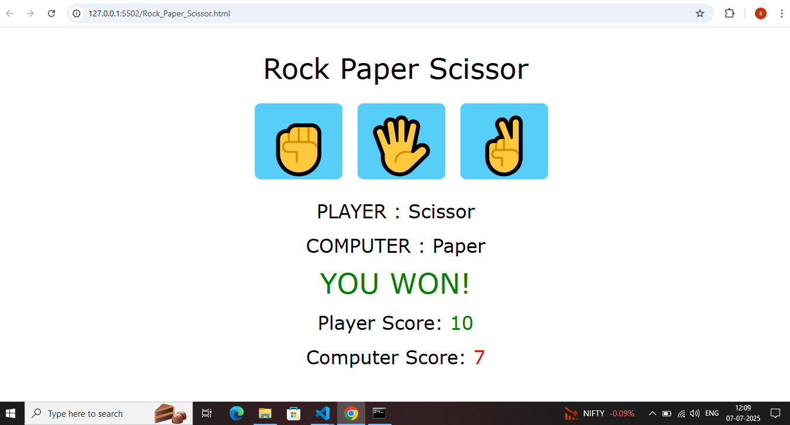

# ✊ Rock Paper Scissor Game

A classic Rock-Paper-Scissor game built using **HTML**, **CSS**, and **JavaScript**.  
Play against the computer and keep score in this simple browser-based game.

---

## 🚀 Features

- 🎮 Choose Rock, Paper, or Scissor
- 🧠 Computer generates a random choice
- 📊 Score tracking for player and computer
- ✨ Simple, clean interface (not responsive)
- ✅ No external libraries or frameworks

---

## 📂 Project Structure

| File                     | Description                          |
|--------------------------|--------------------------------------|
| `Rock_Paper_Scissor.html`| Main HTML structure                  |
| `Rock_Paper_Scissor.css` | Styles for layout and design         |
| `Rock_Paper_Scissor.js`  | JavaScript game logic                |
| `previwe/preview.PNG`    | Static screenshot of the game        |

---

## 📸 Preview



> 💡 Note: This project is designed for desktop only and is **not responsive**.

---

## 🔧 How to Use

```bash
# 1. Clone the repository
git clone https://github.com/syedthedev/rock-paper-scissor-game.git

# 2. Navigate into the folder
cd rock-paper-scissor-game

# 3. Run the app
Open Rock_Paper_Scissor.html in your browser
